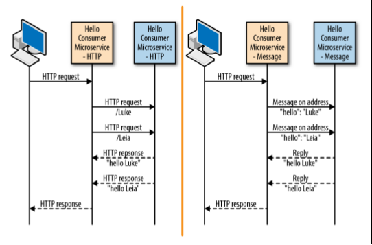

# hello-consumer-microservice-message
That is an java async **message-based** (microservice).  
This is a server application that sends messages when the event bus channel receives an event from [consumer app](https://github.com/geanfelipe/hello-consumer-microservice-message)

like this:  


## About the stack
- It was implemented using the [vertx tookit](https://vertx.io) for building reactive applications on the JVM.
- It was used [infinispan](http://infinispan.org) for clustering the apps 


## Install dependencies and run
```
$ mvn clean install  
$ compile vertx:run -Dvertx.runArgs="-cluster -Djava.net.preferIPv4Stack=true" #in cluster mode
```
Or merely
```
$ compile vertx:run
```

